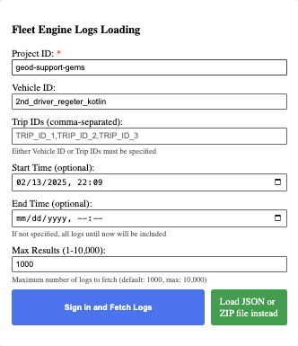

# Fleet Debugger Tool

Fleet Debugger is an open-source web tool designed to help you visualize and analyze logs from Google Maps Platform's Mobility solutions, supporting both [Scheduled tasks](https://developers.google.com/maps/documentation/mobility/fleet-engine/essentials/tasks-intro) and [On-demand trips](https://developers.google.com/maps/documentation/mobility/fleet-engine/essentials/trip-intro). It provides an interactive map and timeline to analyze vehicle and task or trip data, running entirely in your browser.


## Key Features

Fleet Debugger helps you understand complex journey and vehicle behaviors by offering:

*   **Interactive map and timeline replay:** Observe vehicle movement in real time or at an accelerated time-lapse.
*   **Synchronization:** Events are linked across the map, data table, and timeline. Click an event in one place, and it's highlighted everywhere.
*   **Detailed log entry inspection:** Deep dive into API requests and responses.
*   **Filter & inspect log messages:** Use customizable table views to easily find and analyze specific log entries.
*   **File Import:** Load logs from JSON or ZIP files.
*   **Direct Cloud Logging Connection:** Securely fetch logs directly from your Google Cloud project.
*   **Flexible Filtering:** Easily narrow down data by time range, entity IDs, and more.
*   **View status changes:** Track changes in vehicle, trip, task, and navigation status.
*   **Visualize multiple trips:** View all trips or tasks for a single vehicle.
*   **Analyze GPS data:** Examine location, accuracy, and heading information.
    *   **GPS accuracy, speed, and heading analysis:** Detailed analysis tools for these metrics ([GPS accuracy](docs/GPSAccuracy.md), [speed](docs/Speed.md), [heading](docs/Heading.md)).
*   **Analyze dwell times:** Measure time spent at specific locations ([dwell times](docs/DwellTimes.md)).
*   **View planned navigation routes:** See the routes with traffic conditions as experienced by drivers (requires [Restricted Use Logs](#restricted-use-logs)).
*   **See requested vs. actual pickup and dropoff points:** (requires [Restricted Use Logs](#restricted-use-logs)).
*   **Map and Timeslider Interaction:** Click directly on the map or the timeslider to select the nearest log event.
*   **Tracking (Chevron):** Use the tracking button to keep the map centered on the current event during replay.
*   **Exporting Logs:** Export loaded dataset to a local file for easy collaboration.

## Using the Demo Site

The fastest way to get started is using our GitHub hosted site.

This site includes demo data for:

*   [On-demand trips](https://googlemaps.github.io/fleet-debugger/demos/multiple-trips)
*   [Scheduled tasks](https://googlemaps.github.io/fleet-debugger/demos/lmfs/)

## Loading Your Data

Click on any empty "Load Dataset" button to open the data loading interface.



### 1. Direct Cloud Logging Connection (Recommended)

1.  **Configure Parameters:** Input your Project ID, Vehicle ID(s) or Trip/Task ID(s), and the selected time range within the UI.
2.  **Connect to Cloud Logging:** Click the "Sign in and Fetch Logs" button and follow the prompts to authenticate with your Google Account and grant access. You'll need appropriate IAM permissions (e.g., `roles/logging.viewer`) to read logs.

### 2. Import from Log Files

You can load log data from JSON or ZIP files using the "Load JSON or ZIP file instead" button. This is useful for:

*   Analyzing logs shared with you.
*   Loading previously exported datasets.

You can export logs from the Google Cloud Console's Logs Explorer.

> **Note**: All data processing happens client-side. Your logs or API keys are not uploaded to any server. Data is stored in your browser's Local Storage.

## Restricted Use Logs

To see features like the driver's planned navigation route, traffic, and original requested stop locations, you need to enable
[Restricted Use Logs](https://developers.google.com/maps/documentation/mobility/operations/cloud-logging/setup#enable_restricted_use_logs) in your Google Cloud project. This is not required for the tool to function but highly recommended for a richer analysis.

## Managing Datasets

Each dataset has a dropdown menu:

-   **Export:** Save the current dataset as a JSON file to your local system.
-   **Delete:** Remove the dataset from the Fleet Debugger and your browser's local storage.

### Restoring Demo Data

To reload the original demo data:
1.  Select "Delete" from the `Dataset 1` dropdown menu.
2.  Refresh the page. The demo data will be automatically reloaded.

## Running Your Own Server

### Development Setup

1.  Install dependencies:
    *   [Node.js](https://nodejs.org/en/download)
2.  Clone the repository:
    ```bash
    git clone https://github.com/googlemaps/fleet-debugger.git
    cd fleet-debugger
    ```
3.  Install node modules:
    ```bash
    npm install
    ```
4.  Add Maps Javascript API Key to src/constants.js

### Start development server

```bash
npm start
```
This will open the app in your default browser, usually at `http://localhost:3000`.

### Building and Deploying

```bash
# Generate static build
npm run build
```
The static files will be in the `build` folder. You can deploy this folder to any static site hosting service. For Firebase Hosting:

```bash
# Optional: Install Firebase CLI globally
npm install -g firebase-tools

# Deploy to Firebase Hosting
firebase deploy --only hosting
```
(Requires Firebase project setup and `firebase login`)

## Privacy

This project is 100% client-side. Please see our [Privacy Policy](docs/PRIVACY.md) for full details.

## Support & Contributing

This Fleet Debugger tool is offered under an open source license. It is not an officially supported Google product.

*   To report bugs or request features, file an issue on
    [GitHub](https://github.com/googlemaps/fleet-debugger/issues).
*   For technical questions and discussions, use the
    [Google Maps Platform developer community channels](https://developers.google.com/maps/developer-community).
*   To contribute, check the [CONTRIBUTING.md](CONTRIBUTING.md) guide.
