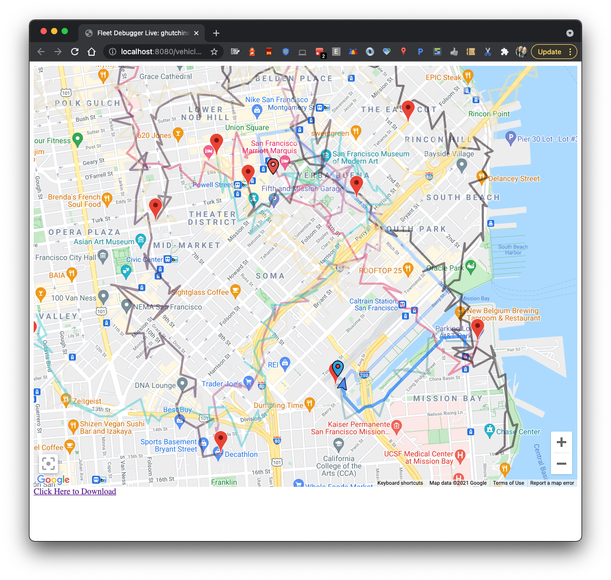

# Fleet Debugger Tool

A debugging tool for use with the stateful Last Mile Fleet Solutions and On Demand Rides and
Deliveries solutions.

## Disclaimer

This is not an officially supported Google product

## Getting Started

### Dependencies

Download & install node
Download & install gcloud

### Setup authentication

```
gcloud config set project <your project id>
gcloud auth login
gcloud auth application-default login
```

### Populate ./node_modules directory

```
npm install
```

## Examples

View historical data from my-vehicle-id via journey sharing SDK

```
# Generate data files
dune-buggy.js historical --apikey <your api key> --vehicle=my-vehicle-id
# start UI (should open up browser to localhost:3000
npm start
```

Generate sharable artifact

```
# Generate data files
dune-buggy.js historical --apikey <your api key> --vehicle=my-vehicle-id
# build sharable, static artifact.  Any webserver should be able to host this.
npm run build
tar -czf support-dump.tgz build
```

## Key Features

Filter & Inspect log messages

Customize which fields are shown in table view

View important status changes: vehicle status, trip status, navigation status

View raw GPS information, including location, accuracy & heading

Visualize multiple trips for one vehicle

Visualize vehicle speeds


