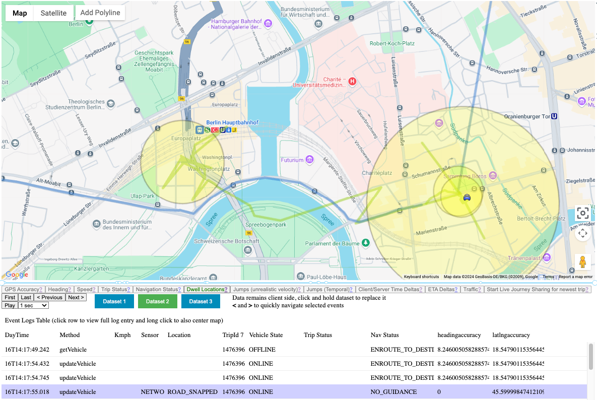

# Dwell Time

The "Dwell Locations" toggle highlights areas on the map where the vehicle remained stationary for a significant period.

*   **What they represent:** These are locations where the vehicle stayed within a **20-meter radius** for at least **2 minutes**.
*   **How they appear:** Dwell locations are shown as yellow circles.
*   **Circle size:** The *size* of the circle indicates the *number of updates* received while the vehicle was at that location.  Larger circles mean more updates were received, suggesting a longer dwell time, but the size *doesn't* directly represent the duration in minutes or hours.

