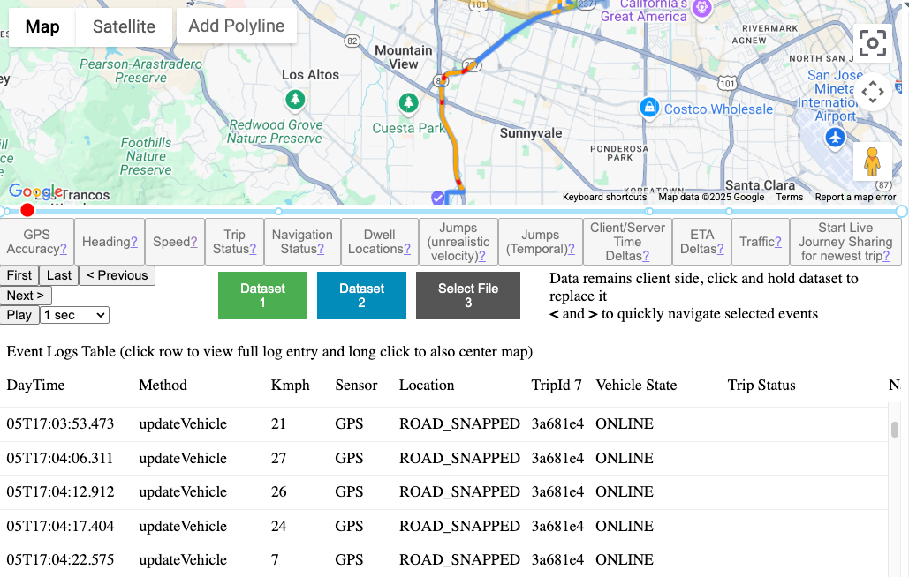

# Planned Paths

Displays all planned routes for the vehicle.
This data comes directly from Navigation SDK, but requires the enablement of restriced use logs.

We are also working on how we can integrate planned paths that are from server side routing. e.g routes from before navigation SDK guidance started.

