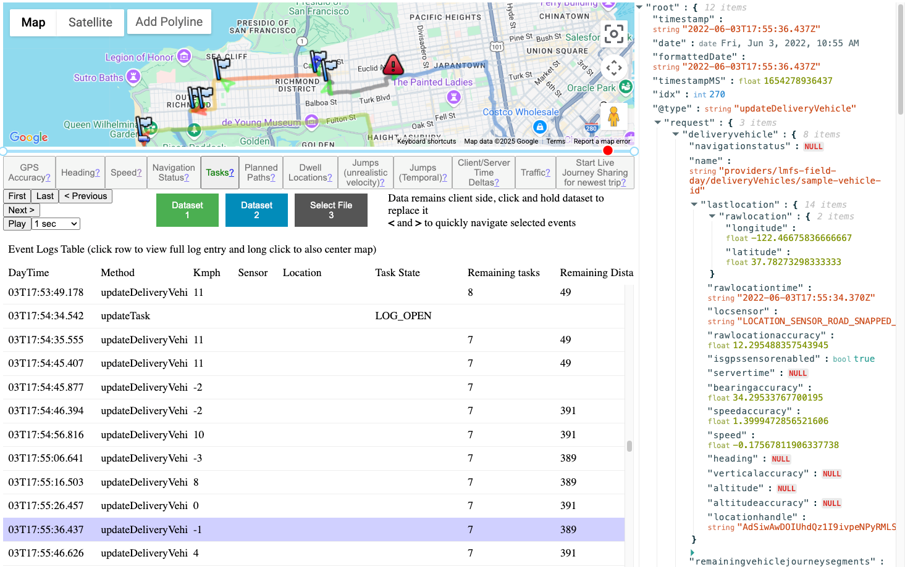

# LMFS Tasks

Displays all tasks assigned to the vehicle.   Time slider allows replaying task state/outcome
changes.  

The red or green arrows indicate the delta between the planned location and outcome location
for the task.

Task markers are clickable and will show basic data in the json viewer.

